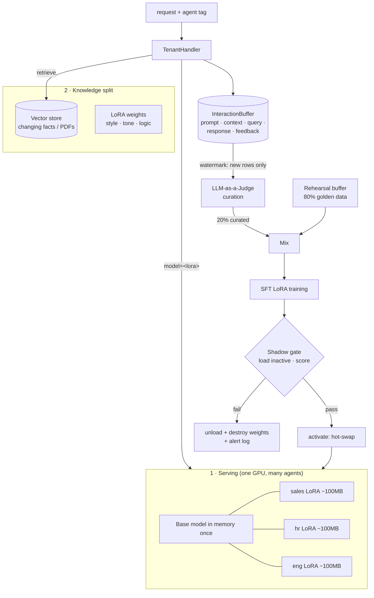

# The Compound AI Architecture

How OmniAI lets non-technical business units spin up agents that continuously
learn **without deviating or hallucinating**. The core rule: strictly separate
**factual knowledge** from **behavioral knowledge**, and never let unreviewed
data reach the weights.



## 1. Serving: multi-tenancy via per-request LoRA

One engine keeps the base model in GPU memory once; each business unit is an
`AgentProfile` whose ~100 MB LoRA adapter is selected **per request** through
the OpenAI `model` field — vLLM/SGLang resolve it to a loaded adapter in
milliseconds, so dozens of distinct agents share a single 48 GB box.

```python
from omniai.tenancy import AgentProfile, AgentRegistry, TenantHandler
from omniai.rag import InMemoryVectorStore, Retriever

products = InMemoryVectorStore()
products.add_document_text(extracted_pdf_text, metadata={"source": "catalog.pdf"})

registry = AgentRegistry()
registry.register(AgentProfile(
    name="sales",
    lora="sales-lora-v3",                      # behavior lives here
    system_prompt="Enthusiastic tone. Always answer in bullet points.",
    retriever=Retriever(products, k=3),        # facts live here
))
registry.register(AgentProfile(name="hr", lora="hr-lora-v1"))

router = GatewayRouter(handler=TenantHandler(registry, engine),
                       interceptors=[PromptGuard()], observers=[buffer])
# clients: POST /v1/messages {"content": "...", "metadata": {"agent": "sales"}}
```

## 2. The knowledge split: RAG vs weights

- **Vector store (facts that change):** product catalogs, policies, uploaded
  PDFs. `VectorStore` is a two-method contract (`add`, `search`); the
  built-in `InMemoryVectorStore` + `HashEmbedder` is dependency-free, and a
  Chroma/Qdrant/pgvector adapter slots behind the same interface. The
  retriever's context block explicitly instructs the model to say "I don't
  know" rather than guess. **You never train facts into weights.**
- **LoRA weights (behavior):** tone, format, reasoning style — the things a
  business unit means by "our agent". Only curated behavioral examples reach
  training.

## 3. Data curation: anti-poisoning

Training on raw chat logs induces model collapse — the agent learns its own
mistakes. Every candidate pair passes through `InteractionJudge`:

- The `TenantHandler` records the full telemetry tuple on each interaction:
  system prompt, RAG context, user query, agent response, and (via message
  metadata) user feedback.
- Explicit feedback short-circuits: `thumbs_down` pairs are discarded,
  `thumbs_up` pairs are kept without spending judge tokens.
- Everything else is scored by a judge model (point it at a **heavier** model
  than the one being trained: `InteractionJudge(engine, model="judge-70b")`).
  Unparseable verdicts count as rejections — when in doubt, don't train.
- The judge callable is injectable (`judge_fn=`), so heuristics or a reward
  model can replace the LLM without code changes.

## 4. Continuous learning: anti-forgetting

- **Watermarking:** the learner pulls only rows logged after the last
  *successful* cycle (`buffer.fetch(since=watermark)`); the watermark is
  persisted in the same SQLite database, so restarts never re-train on
  consumed data and rejected cycles leave the data eligible for the next
  attempt. Adapter version numbers are likewise resumed from disk — a
  restart can't overwrite `-lora-v7` with a new `-lora-v1`.
- **Rehearsal buffer:** a golden set of ~500 diverse general prompts
  (`RehearsalBuffer.from_jsonl("golden.jsonl")`) is mixed into every run —
  by default 20% new curated business data, 80% golden data — so each
  adapter keeps rehearsing general language and reasoning instead of
  overfitting to last week's tickets.

## 5. The shadow gate: safe deployment

The freshly trained adapter is **loaded invisibly** (`activate=False` — live
traffic still routes to the current adapter), scored against the golden
evaluation dataset, and only then promoted:

- **Pass** (accuracy ≥ baseline − tolerance): `activate_lora` flips it into
  production — a metadata change, zero downtime.
- **Fail:** the adapter is unloaded from the server, its weights are
  destroyed on disk, and the rejection is logged as an alert. The watermark
  does not advance.

Wiring the whole loop:

```python
from omniai.memory import (ContinuousLearner, InteractionBuffer,
                           InteractionJudge, LoRATrainer, RehearsalBuffer)
from omniai.evals import AdapterGate, GoldenDataset

buffer = InteractionBuffer("interactions.db", threshold=1000)
judge = InteractionJudge(engine, model="judge-model", min_score=0.7)
gate = AdapterGate(engine, GoldenDataset.from_jsonl("golden_evals.jsonl"))

learner = ContinuousLearner(
    buffer,
    LoRATrainer(engine.config.model),
    engine=engine,
    curator=judge.curate,                             # anti-poisoning
    rehearsal=RehearsalBuffer.from_jsonl("golden.jsonl"),  # anti-forgetting
    evaluator=gate.evaluator,                         # shadow gate
)
buffer.on_threshold = learner.trigger   # supervised task: failures are logged
```
